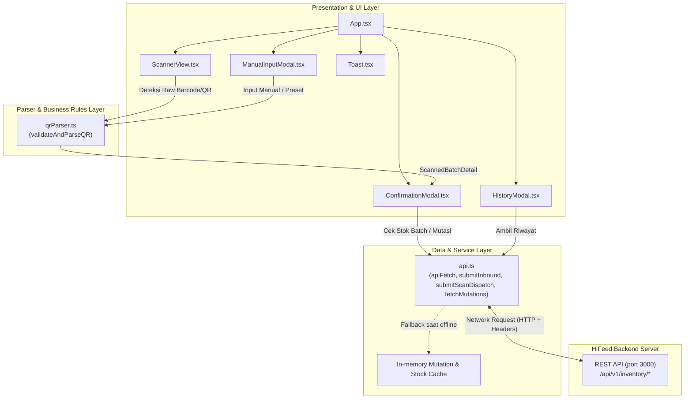

# HiFeed Native — Warehouse & Field Operations (SCOM)

Aplikasi mobile berbasis **React Native** dan **Expo (SDK 57)** yang dirancang untuk operasional pergudangan dan lapangan (Field Operations) pada ekosistem **HiFeed**. Aplikasi ini memfasilitasi pencatatan mutasi stok pakan secara cepat dan akurat melalui pemindaian barcode/QR code (Inbound & Dispatch), verifikasi stok batch *real-time*, serta pencatatan buku besar mutasi (*audit ledger*).

---

## 📋 Daftar Isi
1. [Fitur Utama](#-fitur-utama)
2. [Arsitektur Sistem](#-arsitektur-sistem)
3. [Struktur Direktori](#-struktur-direktori)
4. [Format Payload QR / Barcode](#-format-payload-qr--barcode)
5. [Prasyarat Sistem](#-prasyarat-sistem)
6. [Instruksi Instalasi & Menjalankan](#-instruksi-instalasi--menjalankan)
7. [Konfigurasi & Integrasi API Backend](#-konfigurasi--integrasi-api-backend)
8. [Script yang Tersedia](#-script-yang-tersedia)

---

## 🚀 Fitur Utama

- **Pemindaian Barcode & QR Code Cepat**:
  - Dukungan dual-engine: `@pushpendersingh/react-native-scanner` untuk build native performa tinggi dengan fallback otomatis ke `expo-camera`.
  - Kontrol senter (*torch*) dan pembekuan kamera (*pause/resume*) untuk menghemat daya baterai di lapangan.
  - Visual laser scanner animasi dan area pemindaian responsif.
- **Validasi & Parsing Otomatis Payload**:
  - Mendukung payload JSON standar HiFeed serta fallback format *pipe-delimited* (`BATCH|SKU|EXPIRED`).
- **Pencatatan Mutasi Stok (Inbound & Dispatch)**:
  - **Inbound**: Penerimaan dan penambahan kuantitas batch pakan ke gudang.
  - **Dispatch**: Pengeluaran stok pakan untuk pengiriman/distribusi dengan validasi stok tersisa secara *real-time*.
- **Live Batch Verification**:
  - Pengecekan otomatis informasi stok batch dari server saat kode terdeteksi untuk mencegah *over-dispatch*.
- **Ledger Mutasi Kronologis (Audit Trail)**:
  - Tampilan riwayat mutasi stok (*inbound* & *dispatch*) lengkap dengan waktu, kuantitas, dan operator.
- **Manual Input & Preset Pengujian**:
  - Modal input manual kode batch/SKU dan preset sampel produk untuk keperluan demonstrasi atau pengujian tanpa fisik barcode.
- **Resilient Network & Logging**:
  - Logger API terstruktur, penanganan *timeout*, serta fallback loopback otomatis untuk Android Emulator (`10.0.2.2`).

---

## 🏛️ Arsitektur Sistem

Aplikasi ini menggunakan pola arsitektur **modular berlapis (layered architecture)** yang memisahkan UI, logika parsing/validasi, dan komunikasi data:



### Penjelasan Lapisan Arsitektur:

1. **Presentation / UI Layer (`App.tsx`, `src/components/`)**:
   - Mengelola state global pemindai (status pause, detail batch aktif, visibility modal).
   - Menangani siklus kamera, laser scanner, konfirmasi mutasi stok, riwayat mutasi, dan dialog input manual.
2. **Parser & Domain Layer (`src/utils/qrParser.ts`)**:
   - Bertanggung jawab memvalidasi dan mengekstrak data batch dari teks mentah hasil scan (JSON atau format teks berpola).
   - Memetakan SKU terhadap master data pakan (`KNOWN_FEED_ITEMS`).
3. **Service & Networking Layer (`src/services/api.ts`)**:
   - Lapisan komunikasi HTTP ke backend REST API.
   - Menyertakan header audit operator (`x-user-id: staff-01`, `x-user-role: field_operator`).
   - Dilengkapi fallback otomatis alamat IP emulator Android (`10.0.2.2`) dan mock cache lokal saat server backend tidak dapat dijangkau.
4. **Type Definitions (`src/types/inventory.ts`)**:
   - Kontrak tipe data TypeScript untuk `FeedItem`, `StockBatch`, `StockMutation`, `InboundRequest`, dan `ScanDispatchRequest`.

---

## 📁 Struktur Direktori

```text
native/
├── assets/                  # Aset gambar, ikon adaptif Android, dan splash screen
├── src/
│   ├── components/          # Komponen antarmuka (UI Components)
│   │   ├── ConfirmationModal.tsx   # Modal konfirmasi mutasi Inbound/Dispatch
│   │   ├── HistoryModal.tsx        # Modal riwayat mutasi stok (Audit ledger)
│   │   ├── ManualInputModal.tsx    # Modal input manual & sampel preset
│   │   ├── ScannerView.tsx         # Kamera & overlay pemindaian barcode
│   │   └── Toast.tsx               # Notifikasi toast feedback
│   ├── services/
│   │   └── api.ts           # HTTP client, endpoint API, dan mock fallback
│   ├── types/
│   │   └── inventory.ts     # Interface & tipe data TypeScript
│   └── utils/
│       └── qrParser.ts      # Parser & validator payload barcode/QR
├── App.tsx                  # Komponen utama & state controller aplikasi
├── app.json                 # Konfigurasi Expo project & metadata aplikasi
├── index.ts                 # Entry point registrasi Expo Root Component
├── package.json             # Dependensi dan script Node.js
└── tsconfig.json            # Konfigurasi TypeScript
```

---

## 🏷️ Format Payload QR / Barcode

Aplikasi menerima dua bentuk format payload data:

### 1. Format JSON Standar (Rekomendasi)
```json
{
  "batch_number": "BATCH-2026-HF01-A",
  "sku": "HF-BR-01",
  "expired_date": "2026-12-31"
}
```

### 2. Format Delimiter Pipa (*Pipe-Delimited*)
```text
BATCH-2026-HF01-A|HF-BR-01|2026-12-31
```

---

## 💻 Prasyarat Sistem

Sebelum memulai instalasi, pastikan perangkat pengembangan Anda telah terpasang:

- **Node.js**: Versi `>= 18.x` atau `>= 20.x` (disarankan LTS).
- **Package Manager**: `npm` (v9+) atau `yarn`.
- **Perangkat Pengujian**:
  - **Expo Go** terpasang di ponsel fisik (Android/iOS), ATAU
  - **Android Studio** (Android Emulator), ATAU
  - **Xcode** (iOS Simulator pada macOS).

---

## 🛠️ Instruksi Instalasi & Menjalankan

### 1. Masuk ke Direktori Proyek
Buka terminal dan arahkan ke folder proyek:
```bash
cd native
```

### 2. Instalasi Dependensi
Jalankan perintah instalasi paket:
```bash
npm install
```

### 3. Konfigurasi Variabel Lingkungan (.env)
Salin contoh file environment atau buat file `.env` di root proyek:
```bash
cp .env.example .env
```
Sesuaikan nilai `EXPO_PUBLIC_API_BASE_URL` sesuai target server backend Anda:
```env
# Contoh jika menguji dengan perangkat fisik di jaringan Wi-Fi lokal:
EXPO_PUBLIC_API_BASE_URL=http://192.168.1.71:3000

# Contoh jika menggunakan Android Emulator dan backend di komputer lokal:
# EXPO_PUBLIC_API_BASE_URL=http://10.0.2.2:3000

# Contoh untuk iOS Simulator atau Web:
# EXPO_PUBLIC_API_BASE_URL=http://localhost:3000
```
> [!NOTE]
> Di Expo (SDK 57), variabel lingkungan yang diakses di dalam bundle aplikasi client harus diawali dengan prefix `EXPO_PUBLIC_`. Nilai default `http://192.168.1.71:3000` akan digunakan jika variabel tidak didefinisikan.

### 4. Menjalankan Server Pengembangan Expo
Jalankan perintah:
```bash
npm start
# atau
npx expo start
```

### 5. Membuka Aplikasi
- **Pada HP Fisik via Expo Go**: Scan kode QR yang muncul di terminal menggunakan kamera HP (iOS) atau aplikasi Expo Go (Android).
- **Pada Android Emulator**: Tekan huruf `a` di terminal atau jalankan:
  ```bash
  npm run android
  ```
- **Pada iOS Simulator**: Tekan huruf `i` di terminal atau jalankan:
  ```bash
  npm run ios
  ```
- **Pada Browser Web**: Tekan huruf `w` di terminal atau jalankan:
  ```bash
  npm run web
  ```

---

## 🔌 Konfigurasi & Integrasi API Backend

Aplikasi berkomunikasi dengan backend HiFeed melalui endpoint REST berikut:

| Method | Endpoint | Deskripsi |
|---|---|---|
| `POST` | `/api/v1/inventory/inbound` | Mencatat penerimaan stok baru ke dalam gudang |
| `POST` | `/api/v1/inventory/scan-dispatch` | Mencatat pengeluaran stok pakan dari gudang |
| `GET` | `/api/v1/inventory/batches` | Mengambil data dan jumlah kuantitas batch yang tersimpan |
| `GET` | `/api/v1/inventory/mutations?limit=50&offset=0` | Mengambil daftar riwayat mutasi stok untuk audit ledger |

### Header Audit Permintaan
Setiap panggilan HTTP secara otomatis menyertakan header:
```http
Content-Type: application/json
x-user-id: staff-01
x-user-role: field_operator
```

---

## 📜 Script yang Tersedia

| Command | Keterangan |
|---|---|
| `npm start` | Menjalankan Expo Metro Bundler |
| `npm run android` | Membuka aplikasi langsung di perangkat/emulator Android |
| `npm run ios` | Membuka aplikasi langsung di simulator iOS |
| `npm run web` | Menjalankan aplikasi versi web preview |
